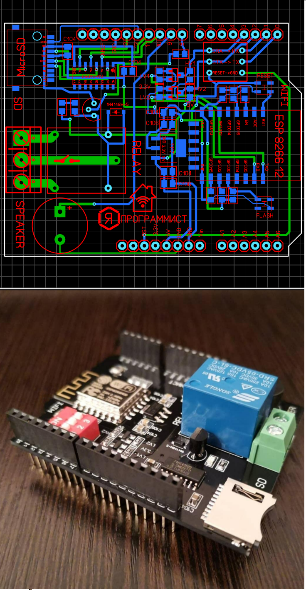

# ArduinoESP8266Shield
ESP8266 shield for Arduino UNO

An Arduino shield with an ESP8266 module is a technological marvel that combines the versatility of an Arduino board with the powerful wireless capabilities of an ESP8266 module. The ESP8266 module is a low-cost Wi-Fi chip that can be used to connect your Arduino projects to the Internet, making them truly "smart" and connected devices.

With this shield, you can easily add Wi-Fi connectivity to your Arduino projects, allowing them to communicate with other devices and services on the Internet. Whether you're building a home automation system, a weather station, or a remote-controlled robot, this shield gives you the tools you need to make it happen.

The shield is designed to be easy to use, with a simple plug-and-play interface that makes it easy to get started. It also features a compact and robust design, making it ideal for use in a wide range of projects and applications.

Overall, an Arduino shield with an ESP8266 module is a powerful tool that opens up a world of possibilities for Arduino enthusiasts and makers. With its combination of ease-of-use, versatility, and powerful wireless capabilities, it's a must-have for anyone looking to take their Arduino projects to the next level.